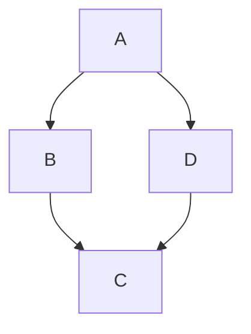

# 四旋翼无人机建模与仿真(Mathematica/Matlab)

# 四旋翼的数学模型
四旋翼无人机的受力模型如下图所示，

<p align="center">
	
    <br>
    <em>Fig. 1: 四旋翼无人机示意图</em>
</p>


## 坐标系

- 地面坐标系(惯性坐标系)——$\{\mathscr{G}:x_{g}y_{g}z_{g}\}$
   该坐标系的三个正交单位基向量记作$\{\bf{E}_x,\bf{E}_y,\bf{E}_z\}$。
- 机体坐标系——$\{\mathscr{B}:x_{b}y_{b}z_{b}\}$
   该坐标系的三个正交单位基向量记作$\{\bf{e}_x,\bf{e}_y,\bf{e}_z\}$。
- 过渡坐标系——$\{\mathscr{S}:xyz\}$
   代表以四旋翼无人机的质心Q为原点，方向与$\{\mathscr{G}\}$相同的过渡坐标系。

## 四旋翼无人机的位置、姿态角

- 四旋翼无人机的位置
    记作$\bf{\xi}_Q=[x_Q,y_Q,z_Q]^T\in \mathbb{R}^3$，
- 四旋翼无人机的姿态角
   按照"横滚-俯仰-偏航''的顺序定义为$\bf{\eta}=[\phi,\theta,\psi]^T\in \mathbb{R}^3$。

## 四旋翼无人机的控制输入

- **螺旋桨转速**

  四旋翼无人机是通过四个电机带动螺旋桨进行控制的，每个螺旋桨在机体坐标系内形成一个升力$f_i$和一个力矩${\tau _{{M_i}}}$，其方向均沿着$z_b$方向，大小与螺旋桨转速的二次方成正比，

  $$
  \begin{equation}
  \begin{aligned}
  {f_i} &= {k_f} n_i^2\\
  {\tau _{{M_i}}} &= {k_\tau} n_i^2\\
  \end{aligned}
  \end{equation}
  $$

  其中，下标$i=1,...,4$表示四个螺旋桨，$n_i$表示螺旋桨的转速，$k_f$和$k_{\tau}$是与螺旋桨的尺寸和类型相关的物理参数。

- **等效力和等效力矩**

   通过将四个螺旋桨产生的升力$f_i$和力矩${\tau _{{M_i}}}$进行线性组合，可以得到作用在机体坐标系内的力和力矩$\bf{U}=[F_z,M_x,M_y,M_z]^T$，即

$$
\begin{equation} 
\left[ {\begin{array}{*{20}{c}}
	{F_z}\\
	{M_x}\\
	{M_y}\\
	{M_z}
	\end{array}} \right] = \left[ {\begin{array}{*{20}{c}}
	{\sum\limits_{i = 1}^4 {{f_i}}}\\
	{{(f_2-f_4)l_a}}\\
	{{(f_1-f_3)l_a}}\\
	{{\sum\limits_{i = 1}^4{\tau_{Mi}}}}
	\end{array}} \right] = \left[ {\begin{array}{*{20}{c}}
	{{k_f}}&{{k_f}}&{{k_f}}&{{k_f}}\\
	0&{{k_f}l_a}&0&{ - {k_f}l_a}\\
	{ - {k_f}l_a}&0&{{k_f}l_a}&0\\
	{k_\tau}&{ - {k_\tau}}&{k_\tau}&-{k_\tau}
	\end{array}} \right]\left[ {\begin{array}{*{20}{c}}
	{n_1^2}\\
	{n_2^2}\\
	{n_3^2}\\
	{n_4^2}
	\end{array}} \right]
\end{equation}
$$

## Euler-Lagrange建模


# 2. 列表
只需要在文字前面加上 - 就可以

## a. 无序标题：

> - 文本1
> - 文本2
> - 文本3

## b. 有序列表：

> 1. text
> 2. text
> 3. text

# 3. 图片和链接

# 4. Latex公式：Latex

## a. 段落内公式

这是段落内的Latex数学公式测试，$\int_a^b f(x)\,dx$. 

Does it work well?

## b. 段落间无编号公式

有时候，需要的是段落间的Latex数学公式，比如下面的这个：

$F(x) = P\{ X <= x \} = \int_{-\infty}^x f(x)dx$

Does it work well?

## c. 段落间带自定义编号的公式

测试加上自定义编号的公式

$$
\begin{equation}
m\ddot{x} + c\dot{x}+kx = 0 
\end{equation}
$$

I refer you to Eq(1)

$$
\begin{equation}
E = mc^2 %\tag{1}
\end{equation}
$$

此处引用公式 Eq\eqref{eq:mck1}.

$$
\begin{equation}
F = ma %\tag{2}
\end{equation}
$$

此处引用公式 Eq\eqref{eq:mck2}.


# 5. 代码高亮，图片显示

## 例1: Maltab


``` 



clear;clc;close all; % matlab
aH = 120;aL = 100;c = 10;b = 1;
rho1 = 0.99;
rho2 = 0.00;
ubar = 3000;
p1 = 0:1:120;
p2 = 0:0.1:75;
% Some functions
funL = @(rho,p)(rho*aH+(1-rho)*aL+b*c-2*b*p);
funR = @(rho,p,ubar)((rho.*b.*ubar.*(aH-aL))./(aL-b.*p).^2);

pc = c*ones(length(p1));
ypc = linspace(0,120,length(p1));
paLb = aL/b*ones(length(p1));
yaLb = linspace(0,120,length(p1));
% Point where they meet
pcE = c;
y1pcE = funL(rho1,pcE);
y2pcE = funR(rho1,pcE,ubar);
x3E = 52;
y3E = funL(rho1,x3E);
x4E = 45;
y4E = funR(rho1,x4E,ubar);
% Plot the bogus functions
figure(1), clf, hold on

plot(p1,funL(rho1,p1),'r',  p2,funR(rho1,p2,ubar),'b', 'linewidth', 2);hold on;
plot(p1,funL(rho2,p1),'r--');

% get rid of standard axes decorations
set(gca, 'Xtick', [], 'Ytick', [], 'box', 'off')

% Fix the axes sizes
axis([0 120 0 120])

% the equilibrium point
plot(pcE, y1pcE, 'k.', 'markersize', 20)
plot(pcE, y2pcE, 'k.', 'markersize', 20)
plot(x3E, y3E, 'k.', 'markersize', 20)
plot(x4E, y4E, 'k.', 'markersize', 20)
% 
% % the dashed lines
line([pcE pcE],[0 y1pcE], 'linestyle', '--', 'color', 'k')
line([aL/b aL/b],[0 100], 'linestyle', '--', 'color', 'k')
axp = get(gca,'Position');

% determine startpoint and endpoint for the arrows 
xs=axp(1);
xe=axp(1)+axp(3);
ys=axp(2);
ye=axp(2)+axp(4);

% make the arrows
annotation('arrow', [xs xe],[ys ys]);
annotation('arrow', [xs xs],[ys ye]);
lx = xlabel('$p$','Interpreter','Latex');
ly = ylabel('$y$','Interpreter','Latex');

set(gca,'TickLabelInterpreter','latex')
set(gca,'xtick',[0,10,aL/b]);
set(gca,'xticklabels',{'$0$','$c$','${a_L}/{b}$'});

% % the static texts
text(70, 55, '$y_1\!\!=\!\!\frac{\rho (a_H-a_L)b \bar u}{(a_L-bp)^2}$',...
​    'Interpreter','Latex', 'fontweight', 'bold','fontsize',14)
text(58, 20, '$y_2\!\!=\!\!\rho a_H\!\!+\!\!(\!1\!-\!\rho\!)a_L\!\!+\!\!bc-\!\!\!2bp$',...
​    'Interpreter','Latex', 'fontweight', 'bold','fontsize',12)
text(pcE+5, y1pcE, '$\rho a_H\!\!+\!\!(\!1\!-\!\rho\!)a_L\!\!-\!\!\!bc$',...
​    'Interpreter','Latex', 'fontweight', 'bold','fontsize',12)
text(pcE+2, y2pcE+10, '$\frac{\rho (a_H-a_L)b \bar u}{(a_L-bc)^2}$',...
​    'Interpreter','Latex', 'fontweight', 'bold','fontsize',15)
text(x3E-1, y3E+6, '$A$',...
​    'Interpreter','Latex', 'fontweight', 'bold','fontsize',15)
text(x4E-3, y4E-6, '$B$',...
​    'Interpreter','Latex', 'fontweight', 'bold','fontsize',15)
```


### 例1运行结果：


## 例2: Javascript


```
// mathjax 
<script>
  (function () {
    var script = document.createElement("script");
    script.type = "text/javascript";
    script.src  = "https://cdn.mathjax.org/mathjax/latest/MathJax.js?config=TeX-AMS-MML_HTMLorMML";
    document.getElementsByTagName("head")[0].appendChild(script);
  })();
</script>


```


## 例3： 普通代码

```
$$ \int_a^b f(x)\,dx $$ #Inline公式

\\[\int_0^{+\infty} x^n e^{-x} \,dx = n! \\]  另起一行居中公式

\\( p\{X=x\}=f(x)=\frac{1}{\sqrt{2\pi}\sigma}e^{-\frac{(x-\mu)^2}{2\sigma^2}} \\)  Inline公式

\\[ p\{X=x\}=f(x)=\frac{1}{\sqrt{2\pi}\sigma}e^{-\frac{(x-\mu)^2}{2\sigma^2}} \\]  另起一行居中公式

$$ F(x) = P\{ X <= x \} = \int_{-\infty}^x f(x)\,dx $$

\\[ f(x,y,z) = 3y^2 z \left( 3 + \frac{7x+5}{1 + y^2} \right). \\]
```




@[VideoLink](https://www.youtube.com/watch?v=0xjwftBTVWM "width:100%;height:350px")

## 未完待续。。。